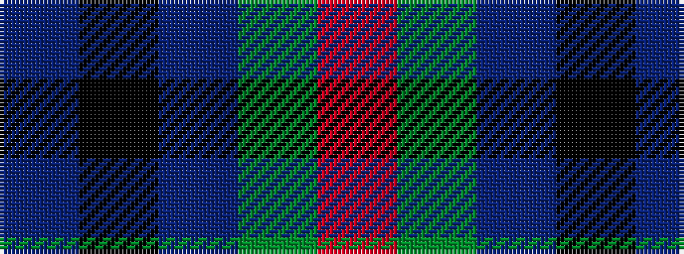

BKBGR

It is a 5 stripe tartan.

<figure class="pat-woven">

<figcaption>idealised sample</figcaption>
</figure>

## Colour Sequence



## Tartans with this colour sequence

| Tartans |
|---------------|
| [Austin (Wilson's No 137)](/variants/s5/dp3k3dp3dg6r2~x2/)|
||
| [Austin / Wilson's No 137](/variants/s5/p3k3p3g6r2~x2/)|
||
