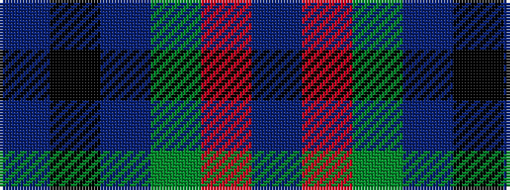

BKBGRB

It is a 6 stripe tartan.

<figure class="pat-woven">

<figcaption>idealised sample</figcaption>
</figure>

## Colour Sequence



## Tartans with this colour sequence

| Tartans |
|---------------|
| [MacTavish / Thom(p)son, hunting](/setts/s6/t3o26g4t13k13t2~x2/)|
||
| [MacTavish / Thom(p)son, hunting](/setts/s6/t4o28g6t12k12t3~x2/)|
||
