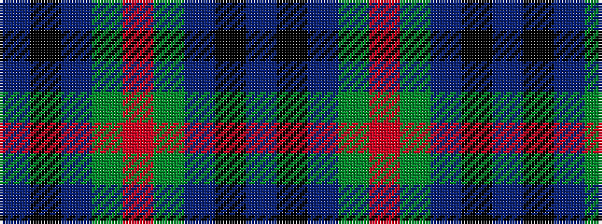

BKBGRGBKB

It is a 9 stripe tartan.

<figure class="pat-woven">

<figcaption>idealised sample</figcaption>
</figure>

## Colour Sequence



## Tartans with this colour sequence

| Tartans |
|---------------|
| [Klappert (Name)](/setts/s9/n16k13n7dy3r2dy3n7k13n16~x2/)|
||
| [Klappert, Denmark (Personal)](/setts/s9/dt16k13dt7dy3r2dy3dt7k13dt16~x2/)|
||
