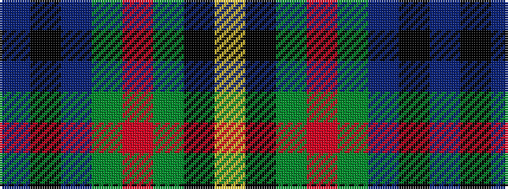

BKBGRGKY

It is a 8 stripe tartan.

<figure class="pat-woven">

<figcaption>idealised sample</figcaption>
</figure>

## Colour Sequence



## Tartans with this colour sequence

| Tartans |
|---------------|
| [Gillies](/setts/s8/db32k12db12g6r6g18k2ly3~x2/)|
||
| [Gillies (House of Edgar)](/setts/s8/b32k12b12g6r6g18k2ly3~x2/)|
||
