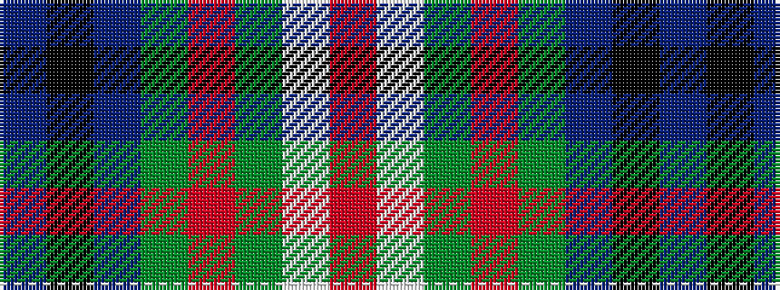

BKBGRGWR

It is a 8 stripe tartan.

<figure class="pat-woven">

<figcaption>idealised sample</figcaption>
</figure>

## Colour Sequence



## Tartans with this colour sequence

| Tartans |
|---------------|
| [Coulter Dress (Personal)](/variants/s8/r6w20g12o3g8t20k2t3~x2/)|
||
