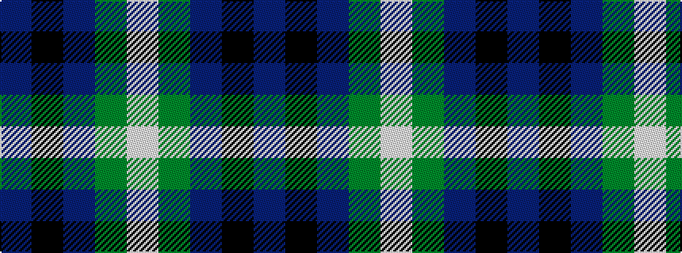

BKBGW

It is a 5 stripe tartan.

<figure class="pat-woven">

<figcaption>idealised sample</figcaption>
</figure>

## Colour Sequence



## Tartans with this colour sequence

| Tartans |
|---------------|
| [Kansai Highland Games](/variants/s5/dp2k1dp16g17w2~x4/)|
||
| [Kansai Highland Games Corporate Tartan](/variants/s5/dp2k1dp16g16w2~x4/)|
||
