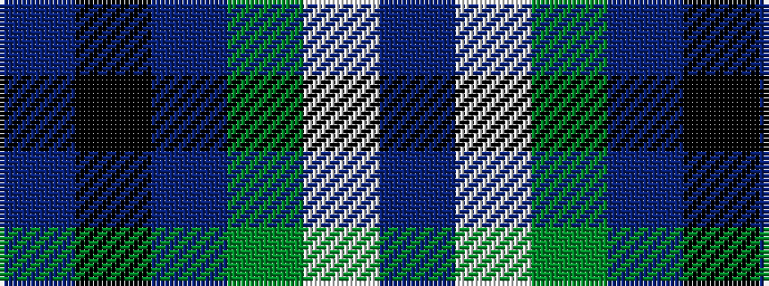

BKBGWB

It is a 6 stripe tartan.

<figure class="pat-woven">

<figcaption>idealised sample</figcaption>
</figure>

## Colour Sequence



## Tartans with this colour sequence

| Tartans |
|---------------|
| [Staley (2014)](/setts/s6/db9w2dg25do10k15dp4~x2/)|
||
