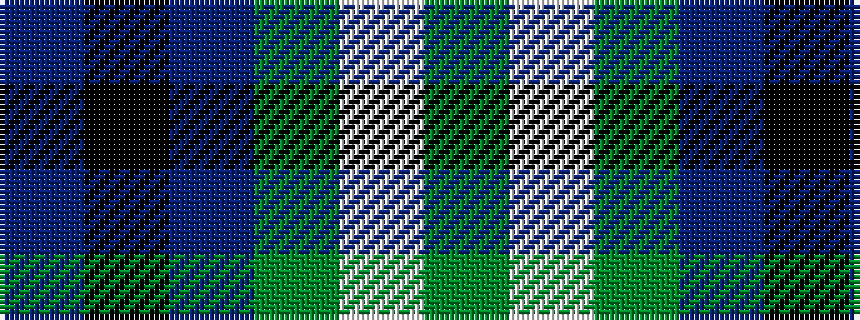

BKBGWG

It is a 6 stripe tartan.

<figure class="pat-woven">

<figcaption>idealised sample</figcaption>
</figure>

## Colour Sequence



## Tartans with this colour sequence

| Tartans |
|---------------|
| [Melville (Two black lines)](/variants/s6/dg4w1dg26b26k2b4~x4/)|
||
| [Oliphant](/setts/db4k4db24g32w1g2/)|
||
| [Oliphant](/variants/s6/db4k4db24dg32lb1dg2~x2/)|
||
