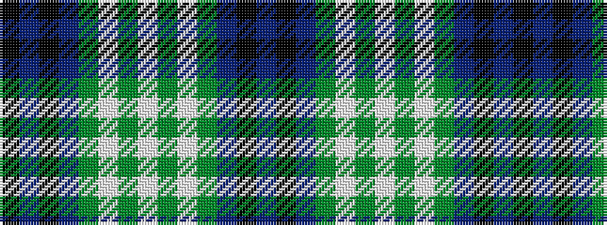

BKBGWGWGWGBKBK

It is a 14 stripe tartan.

<figure class="pat-woven">

<figcaption>idealised sample</figcaption>
</figure>

## Colour Sequence



## Tartans with this colour sequence

| Tartans |
|---------------|
| [Ship Hector, The](/setts/s14/db10k5db16g3w16g5w3g5w16g3db16k5db10ki3~x2/)|
||
