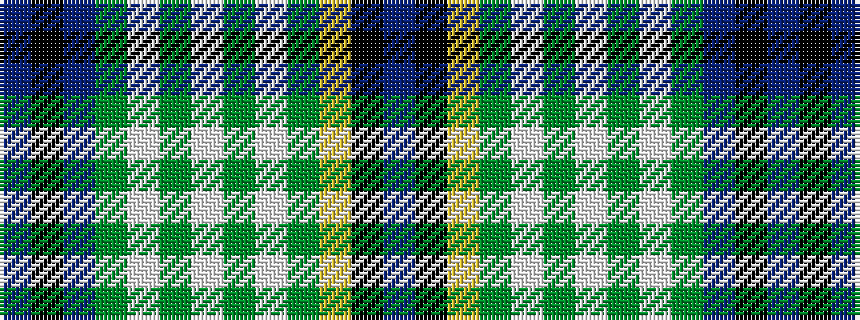

BKBGWGWGWGYKB

It is a 13 stripe tartan.

<figure class="pat-woven">

<figcaption>idealised sample</figcaption>
</figure>

## Colour Sequence



## Tartans with this colour sequence

| Tartans |
|---------------|
| [Stirling Castle (Corporate)](/setts/s13/db2k6db2g34w1g5w1g5w1g34ly1k13db1~x2/)|
||
