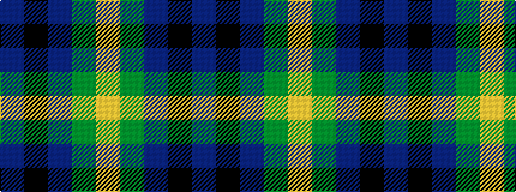

BKBGY

It is a 5 stripe tartan.

<figure class="pat-woven">

<figcaption>idealised sample</figcaption>
</figure>

## Colour Sequence



## Tartans with this colour sequence

| Tartans |
|---------------|
| [Austin (Wilson's No 173)](/variants/s5/dp3k3dp3dg6ly2~x2/)|
||
| [Austin / Wilson's No 173](/variants/s5/p3k3p3g6ly2~x2/)|
||
| [Marshall of Keith (Personal)](/variants/s5/b10k10b10dg26ly5~x2/)|
||
| [Phoenix Police Honor Guard](/variants/s5/db10k3t65dg56ly6/)|
||
| [Phoenix Police Honor Guard (Corp.)](/variants/s5/db10k3t65g56ly6/)|
||
