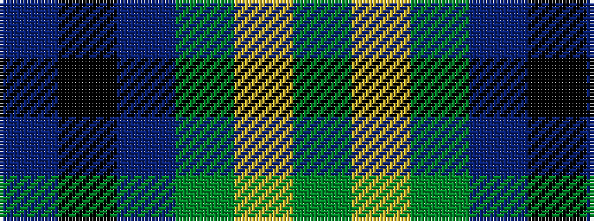

BKBGYG

It is a 6 stripe tartan.

<figure class="pat-woven">

<figcaption>idealised sample</figcaption>
</figure>

## Colour Sequence



## Tartans with this colour sequence

| Tartans |
|---------------|
| [Oliphant](/setts/s6/db4k4db24dg32lr1dg2~x2/)|
||
