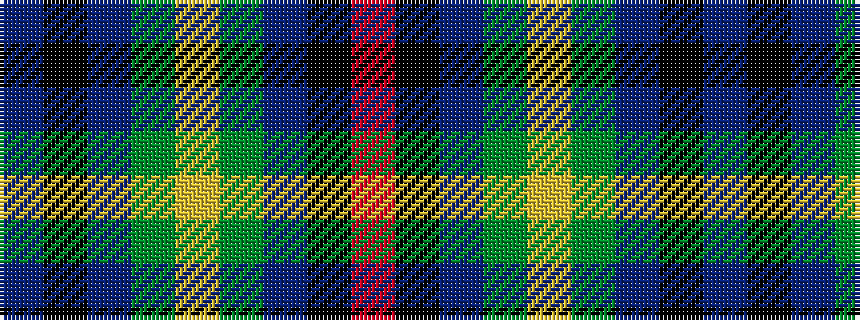

BKBGYGBKR

It is a 9 stripe tartan.

<figure class="pat-woven">

<figcaption>idealised sample</figcaption>
</figure>

## Colour Sequence



## Tartans with this colour sequence

| Tartans |
|---------------|
| [Glackin-McColgan (Personal)](/setts/s9/b16k11b24dg10ly3dg17b15k5r6~x2/)|
||
