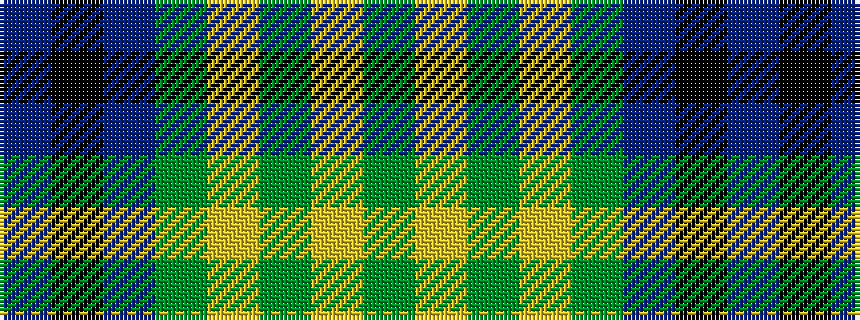

BKBGYGYG

It is a 8 stripe tartan.

<figure class="pat-woven">

<figcaption>idealised sample</figcaption>
</figure>

## Colour Sequence



## Tartans with this colour sequence

| Tartans |
|---------------|
| [Dama Classic](/variants/s8/y30ly3y3ly3y12do30k3do5~x2/)|
||
