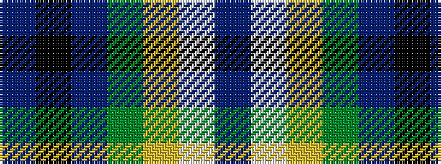

BKBGYWB

It is a 7 stripe tartan.

<figure class="pat-woven">

<figcaption>idealised sample</figcaption>
</figure>

## Colour Sequence



## Tartans with this colour sequence

| Tartans |
|---------------|
| [MacTavish of Dunardry (Clan)](/setts/s7/t8w28lo3g3t8k9t4~x2/)|
||
