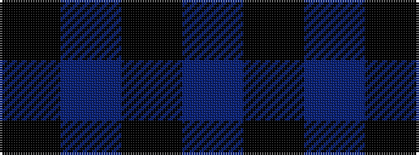

BKBK

It is a 4 stripe tartan.

<figure class="pat-woven">

<figcaption>idealised sample</figcaption>
</figure>

## Colour Sequence



## Tartans with this colour sequence

This pattern is a design lineage: every tartan below shares one colour order, whatever its owner —
near-identical designs are grouped, the largest lineage first (#112: the pattern is a tartan's
second parent, beside its family or clan).

<table class="sett-table">
<tbody>
<tr><td><a href="/tartans/c/cl/clan-anord/">Clan Anord</a></td></tr>
<tr><td class="sett-swatch"></td></tr>
<tr><td><a href="/tartans/l/le/lendrum/">Lendrum</a></td></tr>
<tr><td class="sett-swatch"></td></tr>
<tr><td><a href="/tartans/w/wc/wcwm-9275-1333-2/">Wcwm 9275-1333-2</a></td></tr>
<tr><td class="sett-swatch"></td></tr>
<tr class="cluster-sep"><td></td></tr>
<tr><td><a href="/tartans/l/le/leonard-hunting-2/">Leonard Hunting</a></td></tr>
<tr><td class="sett-swatch"></td></tr>
<tr><td><a href="/tartans/w/wc/wcwm-9275-1333-1/">Wcwm 9275-1333-1</a></td></tr>
<tr><td class="sett-swatch"></td></tr>
<tr class="cluster-sep"><td></td></tr>
<tr><td><a href="/tartans/a/au/auchincloss/">Auchincloss</a></td></tr>
<tr><td class="sett-swatch"></td></tr>
<tr class="cluster-sep"><td></td></tr>
<tr><td><a href="/tartans/o/om/omega-delta-sigma-national-veterans/">Omega Delta Sigma, National Veterans</a></td></tr>
<tr><td class="sett-swatch"></td></tr>
</tbody>
</table>

