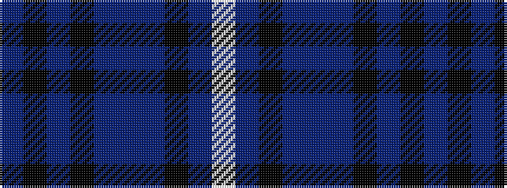

BKBKBBBKBW

It is a 10 stripe tartan.

<figure class="pat-woven">

<figcaption>idealised sample</figcaption>
</figure>

## Colour Sequence



## Tartans with this colour sequence

| Tartans |
|---------------|
| [Melrose Newbigging Grey (Name)](/setts/s10/n1k6n35k6n2dp3n1k6n2w1~x2/)|
||
