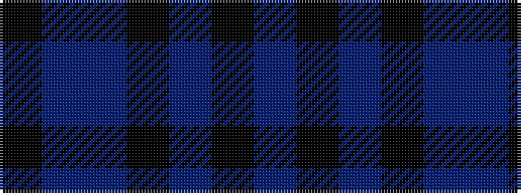

BKBKBBK

It is a 7 stripe tartan.

<figure class="pat-woven">

<figcaption>idealised sample</figcaption>
</figure>

## Colour Sequence



## Tartans with this colour sequence

| Tartans |
|---------------|
| [Strathclyde blue](/setts/s7/k3db24t3k25t22k3t3~x2/)|
||
