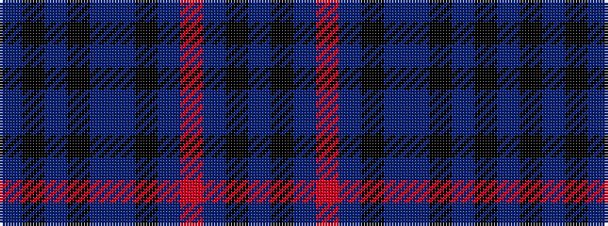

BKBKBBKBRBKB

It is a 12 stripe tartan.

<figure class="pat-woven">

<figcaption>idealised sample</figcaption>
</figure>

## Colour Sequence



## Tartans with this colour sequence

| Tartans |
|---------------|
| [Hopkins (Wales)](/setts/s12/dt5k2dt2k2dt2db5k2db1o1db1k10dt3~x4/)|
||
| [Hopkins Welsh Name Tartan Tartan Number: 3233. Earliest known date: 2002 The tartan for this Welsh surname and its variations, is actually woven in Wales at the Cambrian Woollen Mill, weaving on the same site since 1830. This tartan differs from many traditional patterns in that the warp and weft differ, giving the finished worsted wool cloth more of a predominant stripe, vertically noticeable in the finished Kilt, or Cilt in Wales. See products available Copyright © Blair Urquhart, Comrie, 2015](/setts/s12/db5k2db2k2db2dt5k2dt1o1dt1k10db3~x4/)|
|![Hopkins Welsh Name Tartan Tartan Number: 3233. Earliest known date: 2002 The tartan for this Welsh surname and its variations, is actually woven in Wales at the Cambrian Woollen Mill, weaving on the same site since 1830. This tartan differs from many traditional patterns in that the warp and weft differ, giving the finished worsted wool cloth more of a predominant stripe, vertically noticeable in the finished Kilt, or Cilt in Wales. See products available Copyright © Blair Urquhart, Comrie, 2015 example sett](/setts/s12/db5k2db2k2db2dt5k2dt1o1dt1k10db3~x4/sett.png)|
