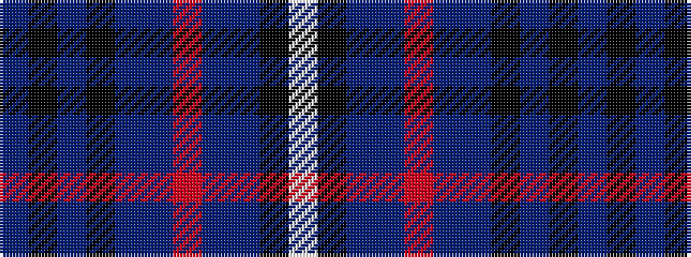

BKBKBBRBBKW

It is a 11 stripe tartan.

<figure class="pat-woven">

<figcaption>idealised sample</figcaption>
</figure>

## Colour Sequence



## Tartans with this colour sequence

| Tartans |
|---------------|
| [Dublin Lie-ins (Corporate)](/setts/s11/dt8k3dt26k11t3dt8r4dt8t3k2w3~x2/)|
||
