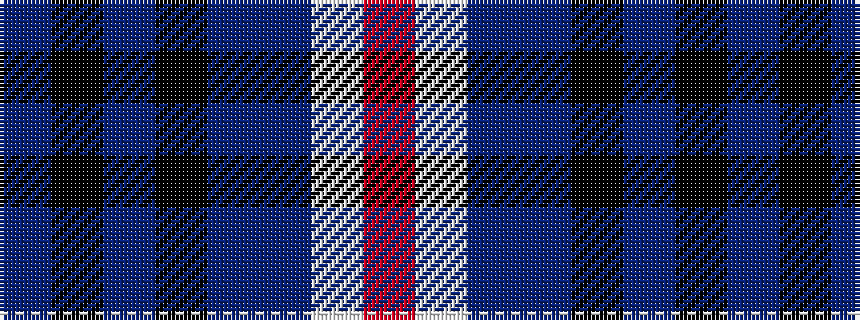

BKBKBBWR

It is a 8 stripe tartan.

<figure class="pat-woven">

<figcaption>idealised sample</figcaption>
</figure>

## Colour Sequence



## Tartans with this colour sequence

| Tartans |
|---------------|
| [Arran - 1989 (Fashion)](/setts/s8/t12k1t1k1t1db8w9o2~x4/)|
||
