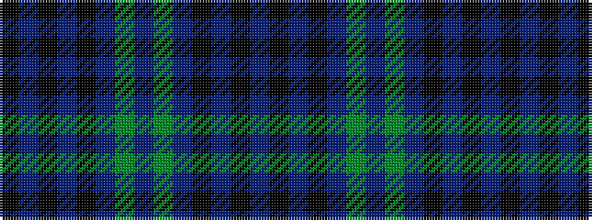

BKBKBGBGBKBKBK

It is a 14 stripe tartan.

<figure class="pat-woven">

<figcaption>idealised sample</figcaption>
</figure>

## Colour Sequence



## Tartans with this colour sequence

| Tartans |
|---------------|
| [Kelvingrove](/variants/s14/k16b1k1b1k1b9g18b1~x4/)|
||
