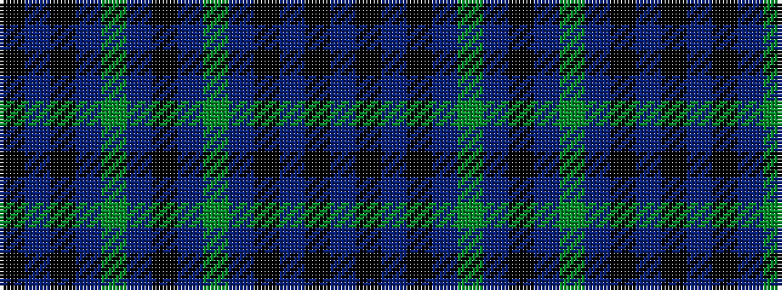

BKBKBGBKBGBKBK

It is a 14 stripe tartan.

<figure class="pat-woven">

<figcaption>idealised sample</figcaption>
</figure>

## Colour Sequence



## Tartans with this colour sequence

| Tartans |
|---------------|
| [Hebrides #9](/setts/s14/k2t18k13t1g16t1k2t1g16t1k13t18k2t2~x2/)|
||
