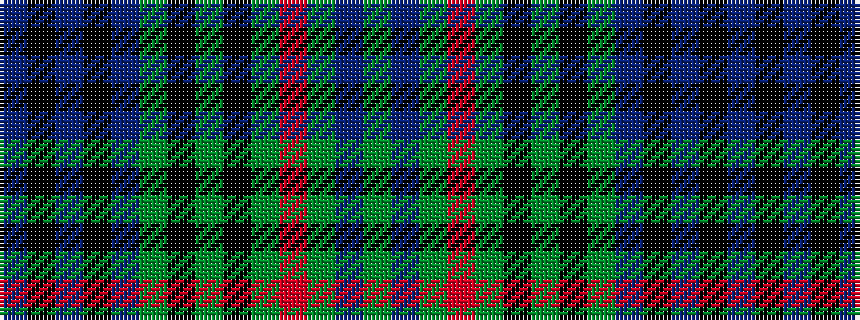

BKBKBGKGKGRGBG

It is a 14 stripe tartan.

<figure class="pat-woven">

<figcaption>idealised sample</figcaption>
</figure>

## Colour Sequence



## Tartans with this colour sequence

| Tartans |
|---------------|
| [Prestoungrange (Personal)](/setts/s14/g3t2g3r4g15k2g2k2g3db35k2db2k1db2~x2/)|
||
| [Prestoungrange/Dolphinstoun/Wills](/setts/s14/g3b2g3r4g15k2g2k2g3db35k2db2k1db2~x2/)|
||
