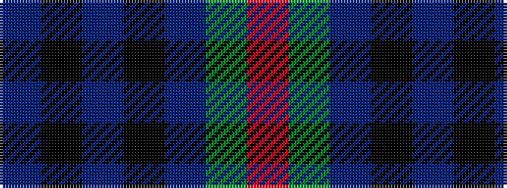

BKBKBGR

It is a 7 stripe tartan.

<figure class="pat-woven">

<figcaption>idealised sample</figcaption>
</figure>

## Colour Sequence



## Tartans with this colour sequence

| Tartans |
|---------------|
| [Bennachie (Whisky)](/setts/s7/dt14k5dp5k5dt14dg32r4~x2/)|
||
