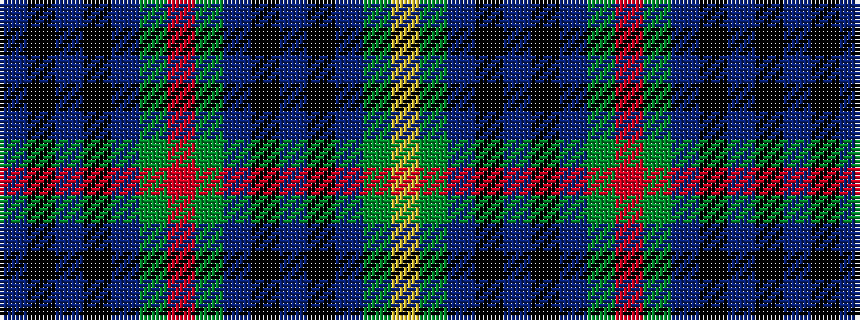

BKBKBGRGBKBKBGY

It is a 15 stripe tartan.

<figure class="pat-woven">

<figcaption>idealised sample</figcaption>
</figure>

## Colour Sequence



## Tartans with this colour sequence

| Tartans |
|---------------|
| [Cambridge](/variants/s15/db73k4t6k4db73g73r4g73db73k4t4k4db73g73ly4/)|
||
