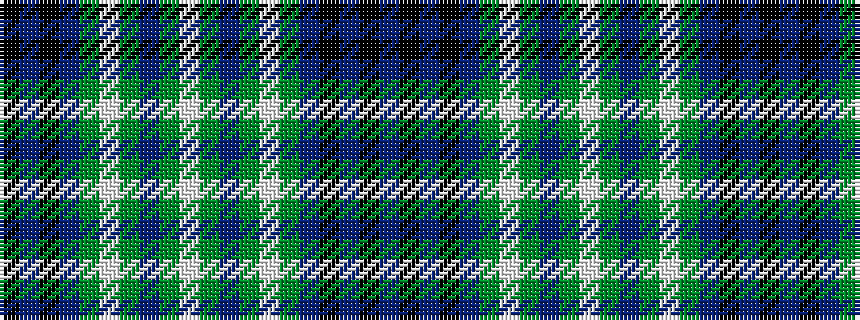

BKBKBGWGBGWGBGWGBKBK

It is a 20 stripe tartan.

<figure class="pat-woven">

<figcaption>idealised sample</figcaption>
</figure>

## Colour Sequence



## Tartans with this colour sequence

| Tartans |
|---------------|
| [Scottish Hockey Union](/setts/s20/db50k10db6k10db6dg5lp5dg5p8dg23w5~x2/)|
||
