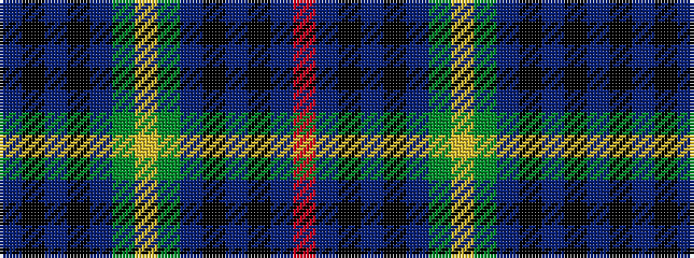

BKBKBGYGBKBKBR

It is a 14 stripe tartan.

<figure class="pat-woven">

<figcaption>idealised sample</figcaption>
</figure>

## Colour Sequence



## Tartans with this colour sequence

| Tartans |
|---------------|
| [Hay-Gray (Personal)](/variants/s14/do18k2do2k2do9dg10ly2dg10dp11k9dp2k2dp1r3~x2/)|
||
