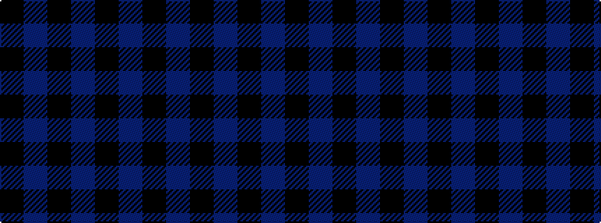

BKBKBK

It is a 6 stripe tartan.

<figure class="pat-woven">

<figcaption>idealised sample</figcaption>
</figure>

## Colour Sequence



## Tartans with this colour sequence

This pattern is a design lineage: every tartan below shares one colour order, whatever its owner —
near-identical designs are grouped, the largest lineage first (#112: the pattern is a tartan's
second parent, beside its family or clan).

<table class="sett-table">
<tbody>
<tr><td><a href="/tartans/b/bl/black-isle/">Black Isle</a></td></tr>
<tr><td class="sett-swatch"></td></tr>
<tr><td><a href="/tartans/f/fr/freedom-of-scotland/">Freedom of Scotland</a></td></tr>
<tr><td class="sett-swatch"></td></tr>
<tr><td><a href="/tartans/g/gr/grey-spirit/">Grey Spirit</a></td></tr>
<tr><td class="sett-swatch"></td></tr>
<tr><td><a href="/tartans/h/hi/highland-4/">Highland</a></td></tr>
<tr><td class="sett-swatch"></td></tr>
<tr><td><a href="/tartans/s/si/silver-mist-2/">Silver Mist</a></td></tr>
<tr><td class="sett-swatch"></td></tr>
<tr><td><a href="/tartans/s/sl/slanj-3/">Slanj</a></td></tr>
<tr><td class="sett-swatch"></td></tr>
<tr class="cluster-sep"><td></td></tr>
<tr><td><a href="/tartans/a/at/atlin/">Atlin</a></td></tr>
<tr><td class="sett-swatch"></td></tr>
<tr><td><a href="/tartans/g/ga/gagetown/">Gagetown</a></td></tr>
<tr><td class="sett-swatch"></td></tr>
<tr class="cluster-sep"><td></td></tr>
<tr><td><a href="/tartans/b/be/ben-dubh/">Ben Dubh</a></td></tr>
<tr><td class="sett-swatch"></td></tr>
<tr class="cluster-sep"><td></td></tr>
<tr><td><a href="/tartans/c/ch/charles-rennie-mackintosh/">Charles Rennie Mackintosh</a></td></tr>
<tr><td class="sett-swatch"></td></tr>
<tr class="cluster-sep"><td></td></tr>
<tr><td><a href="/tartans/l/le/leonard-hunting/">Leonard Hunting</a></td></tr>
<tr><td class="sett-swatch"></td></tr>
<tr class="cluster-sep"><td></td></tr>
<tr><td><a href="/tartans/m/ma/macintosh-charles-rennie/">Macintosh, Charles Rennie</a></td></tr>
<tr><td class="sett-swatch"></td></tr>
<tr class="cluster-sep"><td></td></tr>
<tr><td><a href="/tartans/s/sc/scottish-express-international-2/">Scottish Express International</a></td></tr>
<tr><td class="sett-swatch"></td></tr>
</tbody>
</table>

