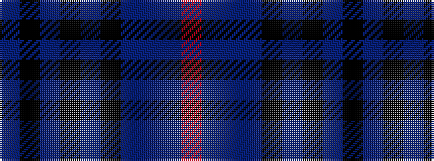

BKBKBKBBBR

It is a 10 stripe tartan.

<figure class="pat-woven">

<figcaption>idealised sample</figcaption>
</figure>

## Colour Sequence



## Tartans with this colour sequence

| Tartans |
|---------------|
| [Comme Ça Il Principe](/setts/s10/dt3k53dt4k4dt4k4dt24db10dt1r1/)|
||
