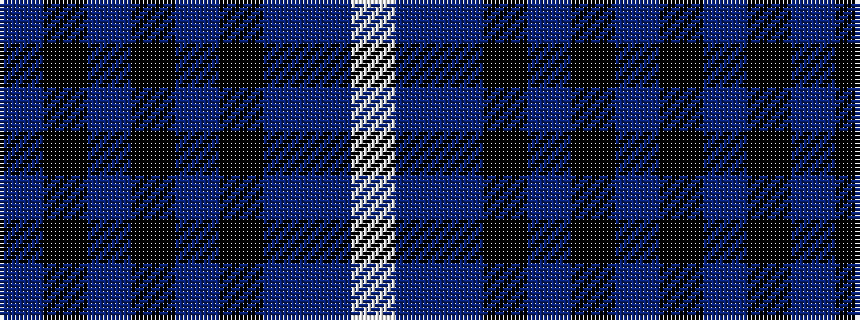

BKBKBKBBW

It is a 9 stripe tartan.

<figure class="pat-woven">

<figcaption>idealised sample</figcaption>
</figure>

## Colour Sequence



## Tartans with this colour sequence

| Tartans |
|---------------|
| [de Franck, Matt (Personal)](/variants/s9/n12k2n2k2n2k12db12b3w1~x2/)|
||
