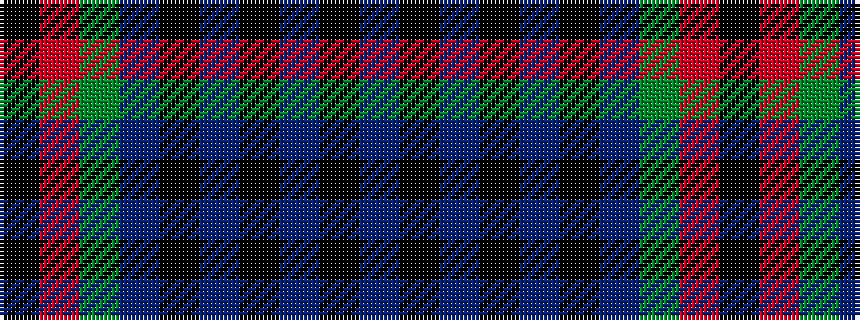

BKBKBKBGRK

It is a 10 stripe tartan.

<figure class="pat-woven">

<figcaption>idealised sample</figcaption>
</figure>

## Colour Sequence



## Tartans with this colour sequence

| Tartans |
|---------------|
| [Bell, Siobhan (Personal)](/setts/s10/k1r1g1db1k1db1k1db1k1dp1~x10/)|
||
