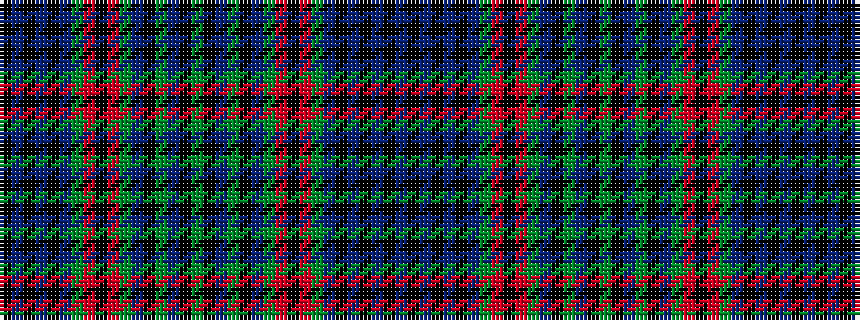

BKBKBKBGRKRGBKGBKGKBGKBGRKRGBKBKBK

It is a 34 stripe tartan.

<figure class="pat-woven">

<figcaption>idealised sample</figcaption>
</figure>

## Colour Sequence



## Tartans with this colour sequence

| Tartans |
|---------------|
| [Whitworth (2003)](/variants/s34/db60k2db2k2db5ki15db5g20r2ki3r2g20db5ki15g5db20k2g4~x2/)|
||
