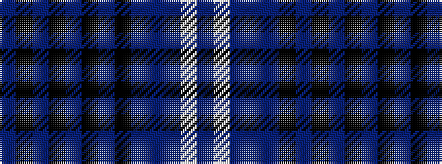

BKBKBKBKBBBWB

It is a 13 stripe tartan.

<figure class="pat-woven">

<figcaption>idealised sample</figcaption>
</figure>

## Colour Sequence



## Tartans with this colour sequence

| Tartans |
|---------------|
| [Highland Storm (Fashion)](/setts/s13/n43k2n2k1n1k11n2k2n1t1n20lb4n7~x2/)|
||
