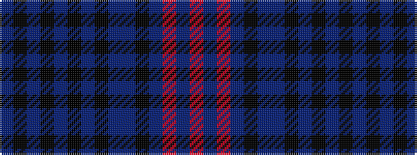

BKBKBKBKBBKBRBR

It is a 15 stripe tartan.

<figure class="pat-woven">

<figcaption>idealised sample</figcaption>
</figure>

## Colour Sequence



## Tartans with this colour sequence

| Tartans |
|---------------|
| [Lochcarron Mill](/setts/s15/n2k6ni2k1ni2k1n2k4n4n2k4n19r2n2r2~x4/)|
||
