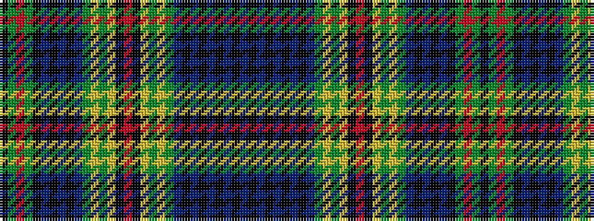

BKBKBKBKBGYGYKRKYGYGBKBKBKGRGK

It is a 30 stripe tartan.

<figure class="pat-woven">

<figcaption>idealised sample</figcaption>
</figure>

## Colour Sequence



## Tartans with this colour sequence

| Tartans |
|---------------|
| [Dundee Discovery (Corporate)](/variants/s30/k14g12r2g12k14db20k2db4k2db20g12lo3g3lo1k3r2k3lo1g3lo3g12db4k2db4k2db22k2db4k2db4~x2/)|
||
