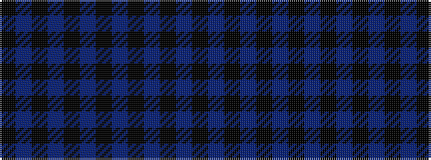

BKBKBKBKBKBK

It is a 12 stripe tartan.

<figure class="pat-woven">

<figcaption>idealised sample</figcaption>
</figure>

## Colour Sequence



## Tartans with this colour sequence

| Tartans |
|---------------|
| [McWilliams (2014)](/setts/s12/k3dt15k9do3k2do14k2do3k9dt13k2dt3~x2/)|
||
