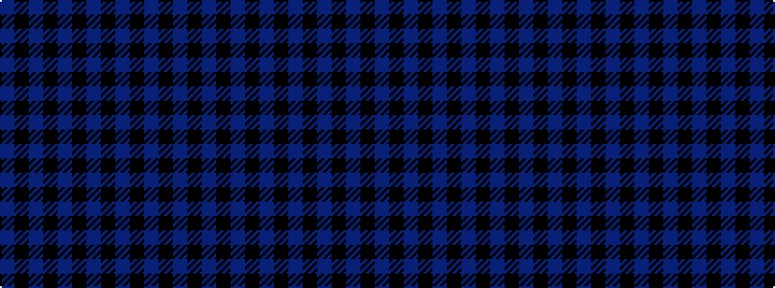

BKBKBKBKBKBKB

It is a 13 stripe tartan.

<figure class="pat-woven">

<figcaption>idealised sample</figcaption>
</figure>

## Colour Sequence



## Tartans with this colour sequence

| Tartans |
|---------------|
| [Glasgow Academy Corporate Tartan](/variants/s13/db22k3db3k3db3k22dp22k4dp22k22db22k4db4/)|
||
| [Glasgow, Academy](/variants/s13/db22k3db3k3db3k22p22k4p22k22db22k4db4/)|
||
