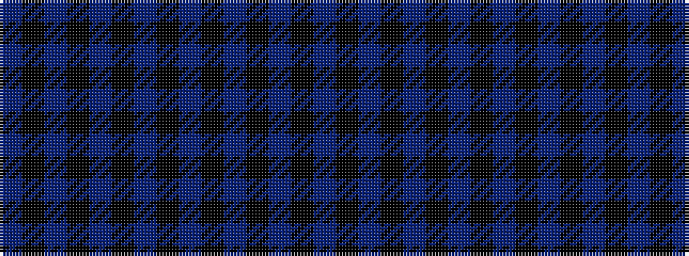

BKBKBKBKBKBKBKB

It is a 15 stripe tartan.

<figure class="pat-woven">

<figcaption>idealised sample</figcaption>
</figure>

## Colour Sequence



## Tartans with this colour sequence

| Tartans |
|---------------|
| [William Murdoch, (Scottish Gas)](/variants/s15/b11k2b4k2b4k11db11k2t4k2db11k11b11k2b4~x2/)|
||
