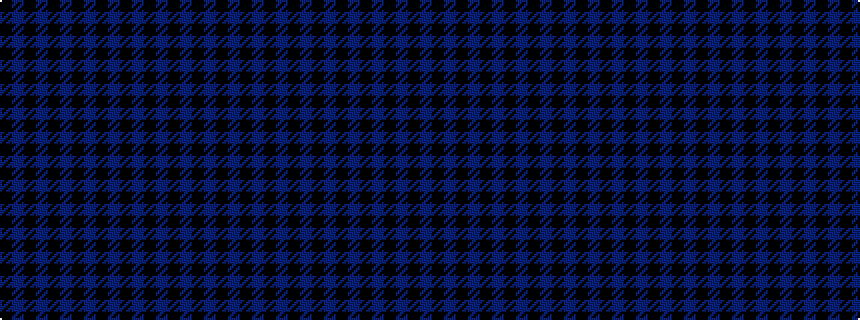

BKBKBKBKBKBKBKBK

It is a 16 stripe tartan.

<figure class="pat-woven">

<figcaption>idealised sample</figcaption>
</figure>

## Colour Sequence



## Tartans with this colour sequence

| Tartans |
|---------------|
| [Dark Island](/variants/s16/k4dt2k43dt20k4dt2k2dt4k2dt2k4dt20k43dt2k4dt2~x2/)|
||
| [Saul (Personal)](/variants/s16/db10k2db2k4b5k6b6k4b6k6b5k4db2k2db10k4~x4/)|
||
