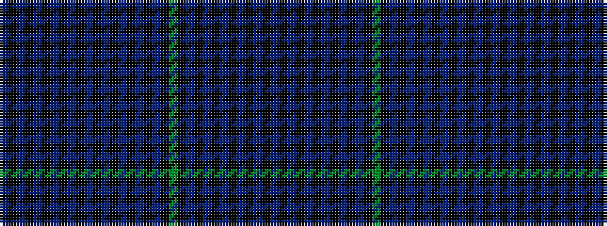

BKBKBKBKBKBKBKBKBKBKGKBKBKBKBKBKB

It is a 33 stripe tartan.

<figure class="pat-woven">

<figcaption>idealised sample</figcaption>
</figure>

## Colour Sequence



## Tartans with this colour sequence

| Tartans |
|---------------|
| [MacDonald, Flora (Artefact)](/variants/s33/b24k4b4k4b4k22b24k6b24k22b18k24b18k22b14k4b4k4b8k1g6k1b8k4b4k4b14k22b4k4b4k4b24~x2/)|
||
