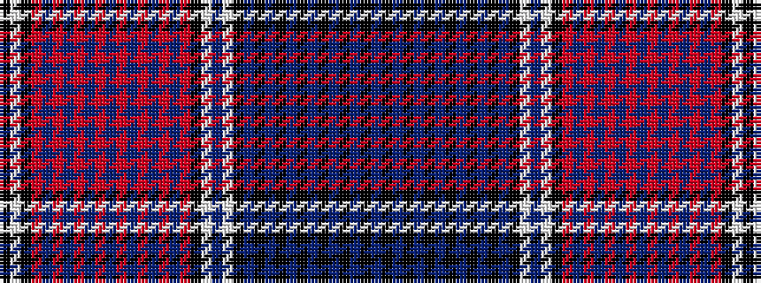

BKBKBKBKBKBKBKWBWKRBRBRBRBRBRBRBRKWK

It is a 36 stripe tartan.

<figure class="pat-woven">

<figcaption>idealised sample</figcaption>
</figure>

## Colour Sequence



## Tartans with this colour sequence

| Tartans |
|---------------|
| [Quebec, Centennial](/setts/s36/db20k1db1k1db1k1db1k1db1k1db1k1db1k8w8db16w50k4r6db28r1db1r1db1r1db1r1db1r1db1r1db1r8k24w12k4/)|
||
