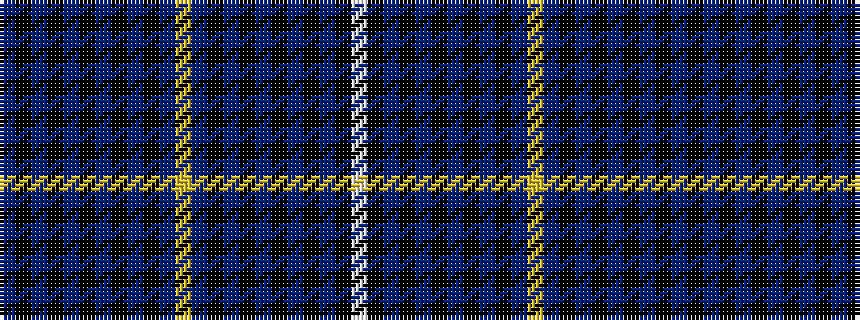

BKBKBKBKBKBYBKBKBKBKBKW

It is a 23 stripe tartan.

<figure class="pat-woven">

<figcaption>idealised sample</figcaption>
</figure>

## Colour Sequence



## Tartans with this colour sequence

| Tartans |
|---------------|
| [Made in Scotland](/variants/s23/w3k9t2k1t2k1t2k1t2k1t20lo2t20k1t2k1t2k1t2k1t2k2p2~x2/)|
||
