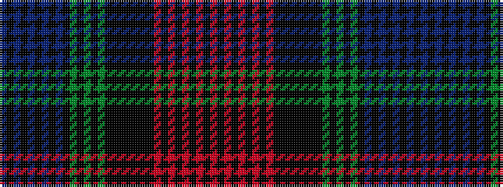

BKBKBKBKBKGKGKGKKKKKKKRKRKRKRKR

It is a 31 stripe tartan.

<figure class="pat-woven">

<figcaption>idealised sample</figcaption>
</figure>

## Colour Sequence



## Tartans with this colour sequence

| Tartans |
|---------------|
| [Same Sex Marriage](/variants/s31/dp2ki2dp1ki14b1ki2b2ki2b1ki14g1ki2g2ki2g1ki14k1ki2k2ki2k1ki14ri1ki2ri2ki2ri1ki14r1ki2r2~x2/)|
||
