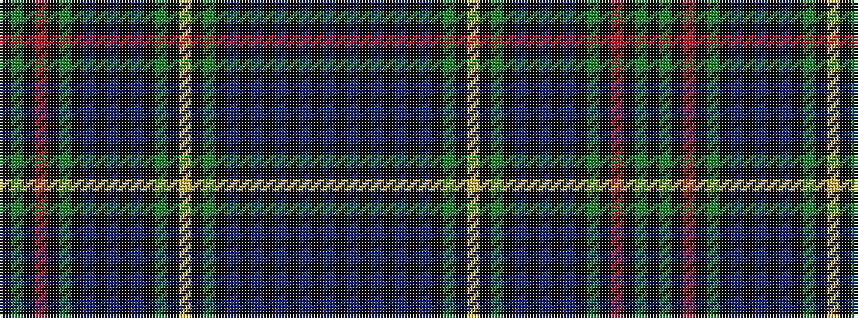

BKBKBKBKBKGKYKGKBKBKBKGKRKGK

It is a 28 stripe tartan.

<figure class="pat-woven">

<figcaption>idealised sample</figcaption>
</figure>

## Colour Sequence



## Tartans with this colour sequence

| Tartans |
|---------------|
| [Farquharson (Vestiarium Scoticum) or MacEwen/MacEwan](/variants/s28/k36dg22k1r4k1dg22k19db16k2db3k2db16k19dg22k1ly4k1dg22k19db3k2db3k2db28k2db3k2db3~x2/)|
||
| [Farquharson or MacEwan Clan Tartan](/variants/s28/k19g22k1r4k1g22k19db16k2db3k2db16k19g22k1ly4k1g22k19db3k2db3k2db28k2db3k2db3~x2/)|
||
