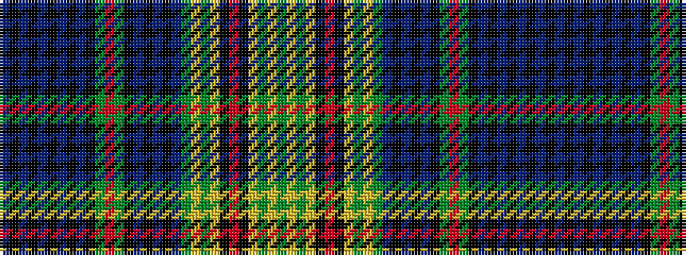

BKBKBKBKBKGRGKBKBKBGYGYKRKYGYG

It is a 30 stripe tartan.

<figure class="pat-woven">

<figcaption>idealised sample</figcaption>
</figure>

## Colour Sequence



## Tartans with this colour sequence

| Tartans |
|---------------|
| [Dundee Discovery](/variants/s30/g10ly3g3ly1k2r2k2ly1g3ly3g10db21k2db2k2db21k15g15r2g15k15db2k2db2k2db31k2db2k2db2~x2/)|
||
