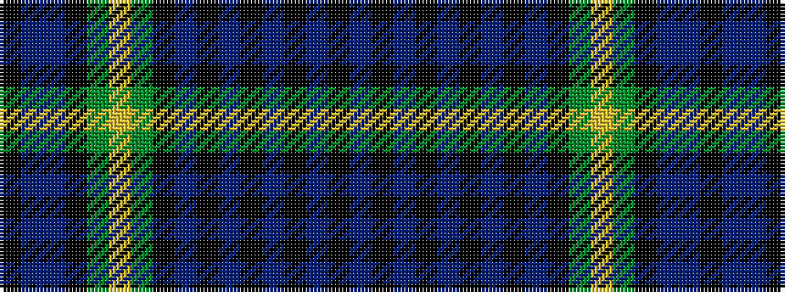

BKBKBKBKBKGYGKBBK

It is a 17 stripe tartan.

<figure class="pat-woven">

<figcaption>idealised sample</figcaption>
</figure>

## Colour Sequence



## Tartans with this colour sequence

| Tartans |
|---------------|
| [North Sea Oil](/setts/s17/k12n3db38k4dy3lo3dy8k56dt4k8dt4k2n4k2dt4k2n4/)|
||
