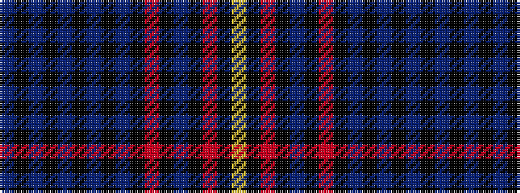

BKBKBKBKBKRKBKRKY

It is a 17 stripe tartan.

<figure class="pat-woven">

<figcaption>idealised sample</figcaption>
</figure>

## Colour Sequence



## Tartans with this colour sequence

| Tartans |
|---------------|
| [Golden Glow](/setts/s17/ly3k2r9k1nii8k1r2k1ni8k1n2k1ni16k1n12k4ni2~x2/)|
||
| [Golden Glow (Fashion)](/setts/s17/ly3k2o9k1ni8k1o2k1n8k1t2k1n16k1t12k4n2~x2/)|
||
