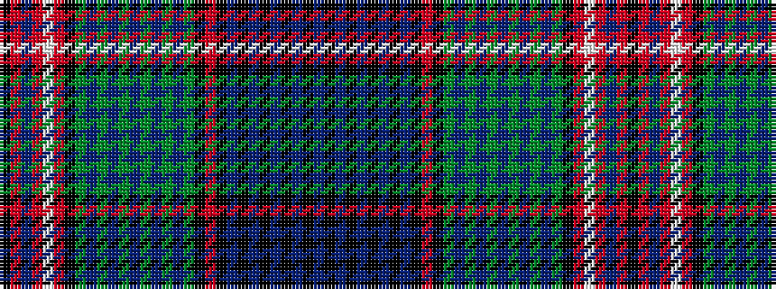

BKBKBKBKBKRKGBGBGBGBGBGKRWRBRK

It is a 30 stripe tartan.

<figure class="pat-woven">

<figcaption>idealised sample</figcaption>
</figure>

## Colour Sequence



## Tartans with this colour sequence

| Tartans |
|---------------|
| [13, Confederation](/setts/s30/k8r8db16r24w4r24k4g6db26g1db1g1db1g1db1g1db1g8k24r12k4db20k1db1k1db1k1db1k1db1~x2/)|
||
