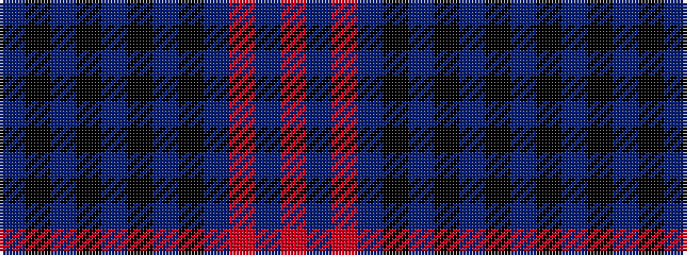

BKBKBKBKBRBR

It is a 12 stripe tartan.

<figure class="pat-woven">

<figcaption>idealised sample</figcaption>
</figure>

## Colour Sequence



## Tartans with this colour sequence

| Tartans |
|---------------|
| [St. Mirren (Corporate)](/setts/s12/doi10k4do16k4do10k16do8k24do28r3doi4r3/)|
||
